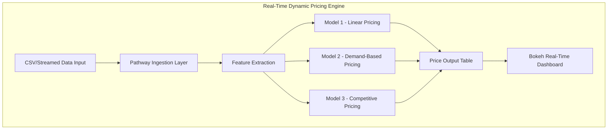

# Capstone_IITG
Capstone Project - Dynamic Pricing for Urban Parking Lots
# 📄 Project Overview

This capstone project builds a real-time, data-driven dynamic pricing engine for 14 urban parking lots. Static pricing leads to inefficiencies like over-occupancy or underutilization. To tackle this, we implement real-time pricing models that adjust based on demand, queue, congestion, vehicle type, and competition.

---

#  Tech Stack
- Python – core logic
- NumPy & Pandas – calculations & data manipulation
- Pathway – real-time data stream ingestion & processing
- Bokeh – real-time visualization
- Google Colab – execution & sharing environment

---

# 🧭 Architecture Diagram (Mermaid)

---

#  Architecture & Workflow
1. Ingestion
   - Real-time data is streamed using Pathway from a simulated or live CSV feed.
   - Schema includes occupancy, queue length, vehicle type, event flag, and lat-long.

2. Model Pipeline
   - **Model 1**: Baseline linear logic with occupancy/capacity ratio.
   - **Model 2**: Constructs a weighted demand function using traffic, events, vehicle type.
   - **Model 3**: Adds proximity-based competitor pricing adjustments.

3. Price Output
   - Prices are smoothed and bounded.
   - Output includes predictions from all 3 models.

4. Visualization
   - Bokeh plots track price movement per lot in real-time.
   - Helps validate pricing behavior across models.
 
 #  Notes & Assumptions
- Pricing varies smoothly between $5 and $20.
- Nearby lots are within 1km (haversine).
- Vehicle weights: truck > car > bike.
- No ML libraries allowed; all logic is hand-coded.
